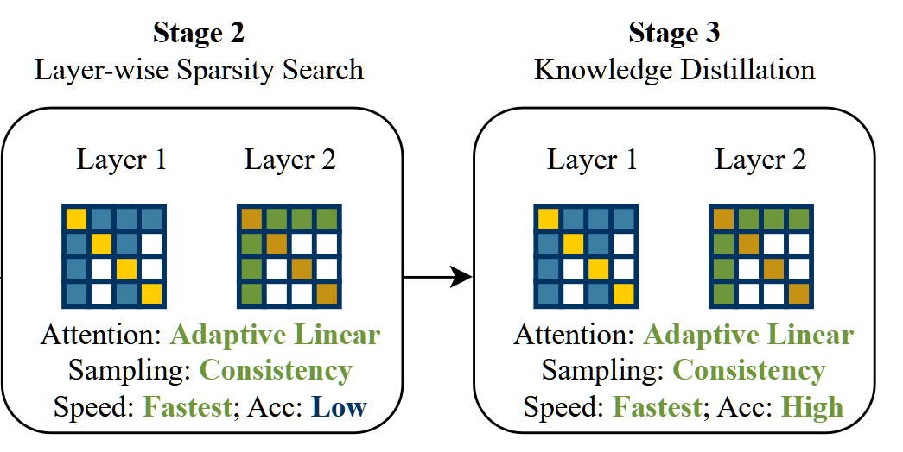
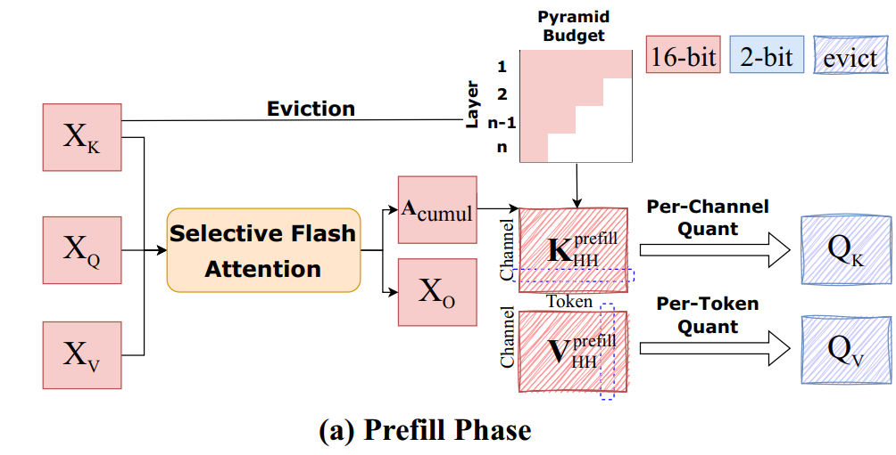

<h2 class="col">
About Me
</h2>

Hey there! I’m Hangliang Ding (丁杭亮), fourth year undergraduate student at <a href="https://www.tsinghua.edu.cn/">Tsinghua University</a>. I am very fortunate to be advised by <a href="https://cseweb.ucsd.edu/~haozhang/">Hao Zhang</a>(UCSD), <a href="https://minjiazhang.github.io/">Minjia Zhang</a>(UIUC) and <a href="http://keg.cs.tsinghua.edu.cn/jietang">Jie Tang</a>(THU) in the past.

My research interests focus on building **efficient** and **reliable** ML systems through system and algorithm co-design, focusing on efficiency, reliability, and scalability. Also,  I aim to explore real-world applications, making these systems truly impactful and accessible for humans. Recently, I am actively looking into Diffusion / MLLM / O1 model efficiency challenges and system bottlenecks.

I'm always excited to exchange ideas and collaborate on research! Whether you have questions about my work or want to explore potential collaborations, please do not hesitate to contact me via email at any time.

Email me at <a href="mailto:pianoqwz@gmail.com" style="color: #52ADC8; text-decoration: none; border-bottom: 1px solid #52ADC8;">pianoqwz@gmail.com</a>.

<h2 class="col">
Academic Experiences
</h2>

<h3 style="font-size: 18px; font-weight: bold; margin-bottom: 10px;">

Efficient-vDiT: Efficient Video Diffusion Transformers With Attention Tile

</h3>

<b>H. Ding</b>*, D. Li*, R. Su, Z. Deng, I. Stoica, H. Zhang

We discover <b><i>Attention Tile</i></b>   pattern in 3D-DiT and develop an efficient video diffusion pipeline that achieves 7.8× speedup on single GPU through consistency distillation and layer-wise profiling, with only 1% pretraining FLOP.

<h3 style="font-size: 18px; font-weight: bold; margin-bottom: 10px;">

MiniKV: 2-Bit Layer-Discriminative KV Cache Compression

</h3>

A. Sharma, <b>H. Ding</b>, J. Li, D. Neel, M. Zhang

<b>MiniKV</b> introduces a layer-discriminative framework that achieves 86% KV cache compression using 2-bit quantization and specialized CUDA flash-attention kernels, while maintaining 98.5% accuracy.

<a href="https://arxiv.org/abs/2411.18077" style="text-decoration: none; color: #52ADC8;">Arxiv</a> available.

<h2 class="col">
Industrial Experiences
</h2>

<!-- 1 -->

<h3><a href="#" style="text-decoration: none;">AgentBench: Evaluating LLMs as Agents</a></h3>

<a style="text-decoration: none;">@Zhipu AI</a>
 &emsp; &emsp; &emsp; &emsp; &emsp; &emsp; &emsp; &emsp; &emsp; &emsp; &emsp; &emsp; &emsp; &emsp; &emsp; &emsp; &emsp;&emsp; &emsp; &emsp; &emsp; &emsp; &emsp; &emsp; &emsp; &emsp; &emsp; Beijing, China; March 2023 - Jan. 2024

<ul>
    <li>Project: <a href="https://github.com/THUDM/AgentBench" style="color: #52ADC8; text-decoration: underline;">AgentBench</a>, <strong>ICLR 2024</strong>, ⭐ 2.3k+
    <li>I classified real-world browsing options and designed auto-collected browsing traces data framework, building a more efficient language model-driven automated web navigation agent.</li>
    </li>
</ul>

<h2 class="col">
Hobbies
</h2>

<ul>
    <li>Ping Pong. I am a member and referee of our department's ping pong team.</li>
    <li>Playing Guitar. I am the lead guitarist of Susu (素数), a math rock band active in Beijing. Check out our recent <a href="https://www.bilibili.com/video/BV1Lqi6YqExg/" style="color: #52ADC8; text-decoration: underline;">live performance</a> at Susu Lab.</li>
</ul>