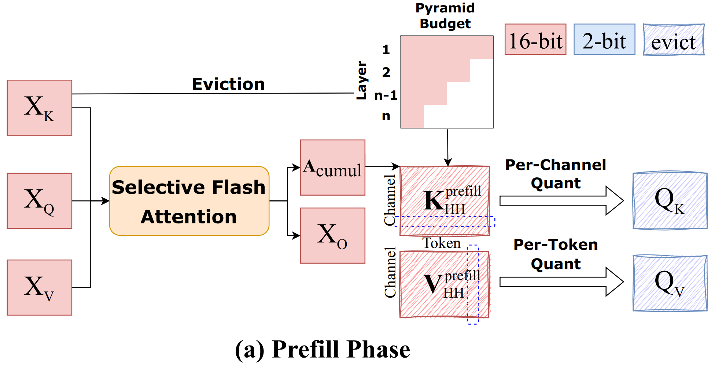

<h2 class="col">
About Me
</h2>

Hey there! I’m Hangliang Ding, fourth year undergraduate student at <a href="https://www.tsinghua.edu.cn/">Tsinghua University</a>. I am very fortunate to be advised by <a href="https://cseweb.ucsd.edu/~haozhang/">Hao Zhang</a>(UCSD), <a href="https://minjiazhang.github.io/">Minjia Zhang</a>(UIUC) and <a href="http://keg.cs.tsinghua.edu.cn/jietang">Jie Tang</a>(THU) in the past.

My research interests focus on building **efficient** and **reliable** ML systems through system and algorithm co-design, focusing on efficiency, reliability, and scalability. Also,  I aim to explore **real-world applications**, making these systems truly impactful and accessible for humans. Recently, I am actively looking into (M)LLM / Diffusion model efficiency challenges and system bottlenecks.

I'm always excited to exchange ideas and collaborate on research! Whether you have questions about my work or want to explore potential collaborations, please do not hesitate to contact me via email at any time.

Email me at <a href="mailto:pianoqwz@gmail.com" style="color: #52ADC8; text-decoration: none; border-bottom: 1px solid #52ADC8;">pianoqwz@gmail.com</a>.

<h2 class="col">
News
</h2>

- 2025-02 Released <a href="https://arxiv.org/abs/2502.06155" style="color: #52ADC8; text-decoration: underline;"> Efficient-vDiT</a> and <a href="https://arxiv.org/abs/2502.04507" style="color: #52ADC8; text-decoration: underline;"> STA</a>, an acceleration pipeline and fast kernel design for video diffusion models。

- 2024-12 Released  <a href="https://github.com/hao-ai-lab/FastVideo" style="color: #52ADC8; text-decoration: underline;">FastVideo</a> the first open-source distillation recipes for video DiT.

- 2024-11 Introduced <a href="https://arxiv.org/abs/2411.18077" style="color: #52ADC8; text-decoration: underline;">MiniKV</a>, an efficient 2-bit layerwise <i>KV cache</i> compression framework.

<h2 class="col">
Academic Experiences
</h2>

<h3 style="font-size: 18px; font-weight: bold; margin-bottom: 10px;">

Efficient-vDiT: Efficient Video Diffusion Transformers With Attention Tile

</h3>

<b>H. Ding</b>*, D. Li*, R. Su, Z. Deng, I. Stoica, H. Zhang

We discover <b><i>Attention Tile</i></b> pattern in 3D-DiT and develop an efficient video diffusion pipeline that achieves 7.8× speedup on single GPU through <b>block-sparse kernel</b> and consistency <b>distillation</b>.

<h3 style="font-size: 18px; font-weight: bold; margin-bottom: 10px;">

MiniKV: 2-Bit Layer-Discriminative KV Cache Compression

</h3>

A. Sharma, <b>H. Ding</b>, J. Li, D. Neel, M. Zhang

<b>MiniKV</b> introduces a layer-discriminative framework that achieves 86% KV cache compression using <b>2-bit</b> quantization and specialized CUDA <b>cumulated attention kernels</b>, while maintaining 98.5% accuracy.

<a href="https://arxiv.org/abs/2411.18077" style="text-decoration: none; color: #52ADC8;">Arxiv</a> available.

<h2 class="col">
Open-source Project
</h2>

<h3><a href="#" style="text-decoration: none;">FastVideo: Accelerate Video Diffusion Model Generation</a></h3>

<ul>
    <li>Project: <a href="https://github.com/hao-ai-lab/FastVideo" style="color: #52ADC8; text-decoration: underline;">FastVideo</a>, 
    <li> First open distillation recipes for video DiT and support distilling and finetuning for state-of-the-art open video DiTs. </li>
    <li> Scalable training with FSDP, sequence parallelism, and selective activation checkpointing, with near linear scaling to 64 GPUs.</li>
    <li> Memory efficient finetuning with LoRA, precomputed latent, and precomputed text embeddings.</li>
    </li>
</ul>

<h3><a href="#" style="text-decoration: none;">AgentBench: Evaluating LLMs as Agents</a></h3>

<ul>
    <li>Project: <a href="https://github.com/THUDM/AgentBench" style="color: #52ADC8; text-decoration: underline;">AgentBench</a>, <strong>ICLR 2024</strong>, 
    <li>Classify real-world browsing options and design auto-collected browsing traces data framework, building a more efficient language model-driven automated web navigation agent.</li>
    </li>
</ul>

<h2 class="col">
Hobbies
</h2>

<ul>
    <li>Guitar. I am the lead guitarist of Susu (素数), a math rock band active in Beijing. Check out our recent <a href="https://www.bilibili.com/video/BV1Lqi6YqExg/" style="color: #52ADC8; text-decoration: underline;">live performance</a> at Susu Lab.</li>
    <li>Pingong. I am a member and referee of our department's ping pong team.</li>
</ul>

